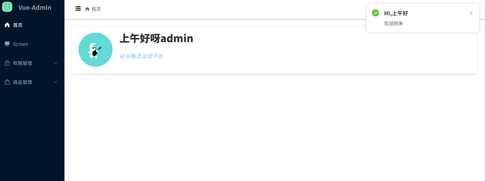
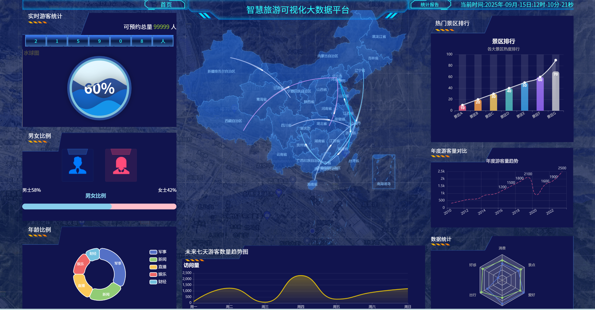
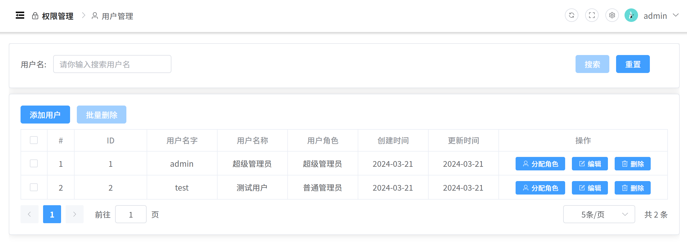
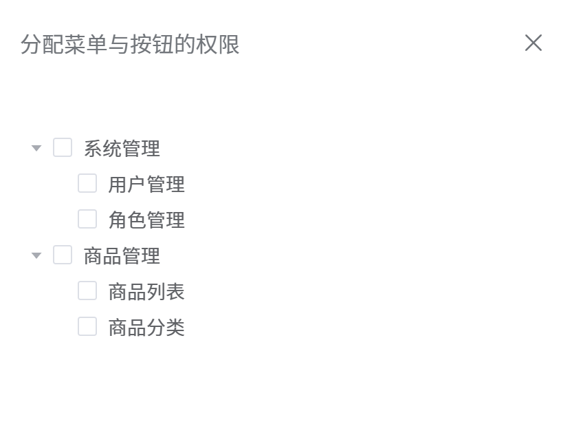
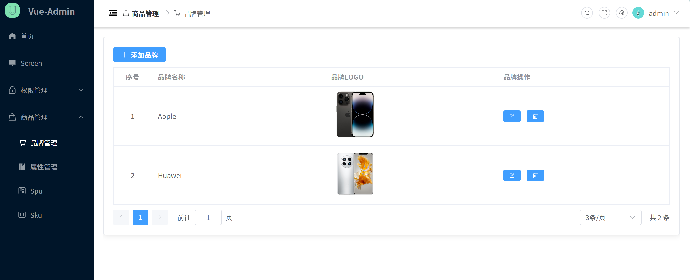
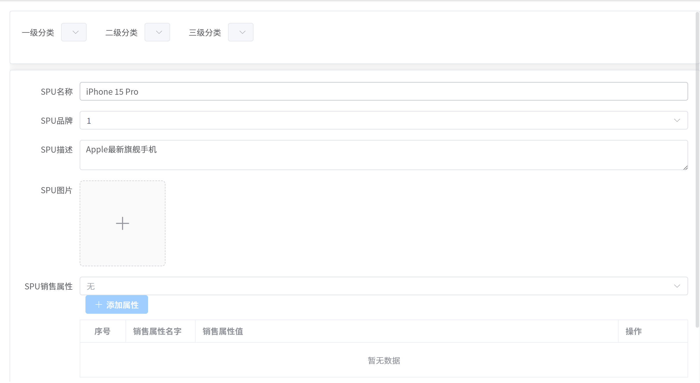
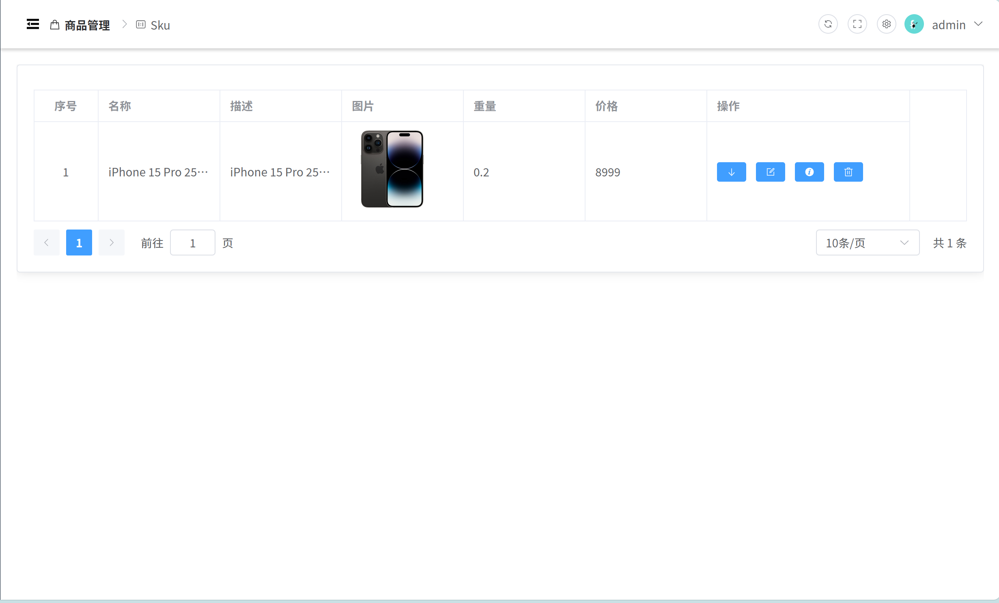
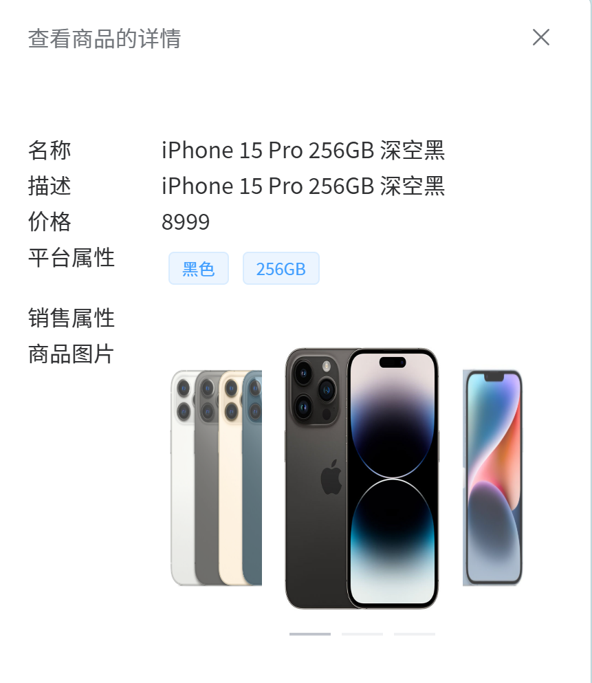

<h1 align="center">
    智控云RBAC管控平台
</h1>
<p align="center">
    <a href="https://github.com/vuejs/vue">
      
    </a>
    <a href="https://github.com/ElemeFE/element">
      
    </a>
    <a href="#">
        
    </a>
    <a href="#">
        
    </a>
</p>


> 一个基于 Vue3 + TypeScript 开发的高仿企业级后台管理系统，核心实现了基于 RBAC 模型的精细化权限控制与数据可视化。

## ✨ 特性亮点

-   **🔐 精细化权限控制**：基于 RBAC（角色基于访问控制）模型，实现动态路由生成与按钮级权限指令。
-   **📊 深度数据可视化**：集成 ECharts，提供丰富的图表组件，支持数据看板与响应式布局。
-   **🎨 主题与布局**：支持明暗主题切换、侧边栏折叠、面包屑导航，提供灵活的用户体验。
-   **📦 高质量组件**：封装高性能表单校验、图片上传等通用组件，减少30%重复代码。
-   **⚡ 极致性能**：基于 Vite 构建，首屏加载速度快。

## 🛠 技术栈

-   **前端框架**: Vue 3 (Composition API + `<script setup>`)
-   **开发语言**: TypeScript
-   **构建工具**: Vite
-   **状态管理**: Pinia
-   **UI 组件库**: Element Plus
-   **可视化**: ECharts
-   **路由工具**: Vue Router 4
-   **HTTP 客户端**: Axios
-   **包管理**: pnpm

## 🚀 快速开始

### 前置条件

确保你的开发环境中已安装：

-   Node.js (版本 >= 16)
-   pnpm (推荐) 或 npm

安装 pnpm

```
npm i pnpm -g
```

### 安装与运行

```bash
# 克隆项目
git clone https://github.com/L-try/vue-admin-main.git

# 进入项目目录
cd your-project-name

# 安装依赖
pnpm install

# 启动开发服务器
pnpm dev

# 打包
pnpm run build
```

## 📸 项目预览


*登录页面，支持表单验证与Token认证*



*首页，实现提示信息和刷新、全屏、更换主题颜色*



*数据可视化看板，集成多种ECharts图表*



*权限页面，实现用户增删改查*



*基于树形控件的角色-权限配置界面*



*商品管理列表-品牌管理*



*实现商品spu管理—增删改查*



*商品管理—sku页面*



*商品详情浏览—sku详情界面，实现抽屉侧展开，照片轮播图*


## 📁 项目结构

text

```
src/
├── api/           		# 数据接口
│   ├── acl/            # 权限管理接口
│   ├── product/        # 商品管理接口
│   └── user/           # 用户信息相关接口
├── assets/             # 静态资源
├── components/         # 全局公共组件
│   ├── Category/       # 三级分类查询组件
│   ├── Pageination/    # 分页组件
│   └── SvgIcon/        # 精灵图图标组件   
│   └── index.ts/  		#注册全局样式
├── dirtective/         # 按钮权限
├── layout/             # 页面整体布局
├── router/             # 路由配置（包含动态路由逻辑）
├── store/              # Pinia 状态管理（用户、权限、应用状态）
├── utils/              # 工具函数（权限指令、请求封装）
└── styles/             # 全局样式
├── views/              # 页面级组件
│   ├── srceen/         # 数据看板
│   ├── acl/            # 系统管理（用户、角色、权限）
│   ├── home/           # 首页
│   ├── login/          # 登录页
│   └── product/        # 商品管理页  
│   └── 404/  		    #错误页
├── App.vue/             
├── main.ts/             # 入口文件  
├── permission.ts/       # 路由守卫
└── setting.ts/          # 标题设置
```
